# DEPLOYMENT WEB APP PHP WITH PHPMYADMIN AND MYSQL

## Deployment phpMyAdmin and MySQL
- Membuat directory baru ```mkdir phpmyadmin``` untuk mendeploy phpMyAdmin dan MySQL di docker
- Membuat file docker compose ```nano docker-compose.yml``` sebagai berikut <br>
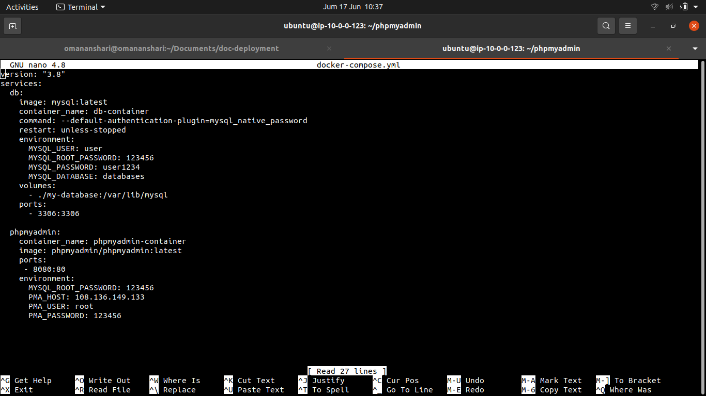 <br>

- Jalankan perintah ```docker-compose.yml up -d``` untuk membuat image dan container sesuai konfigurasi di docker compose
- Selanjutnya buka browser ketik IP server dan port docker dari container yang telah di deploy
- Pilih nama database yang telah di buat, kemudian pilih ```Import``` lalu ```Choose File``` <br>
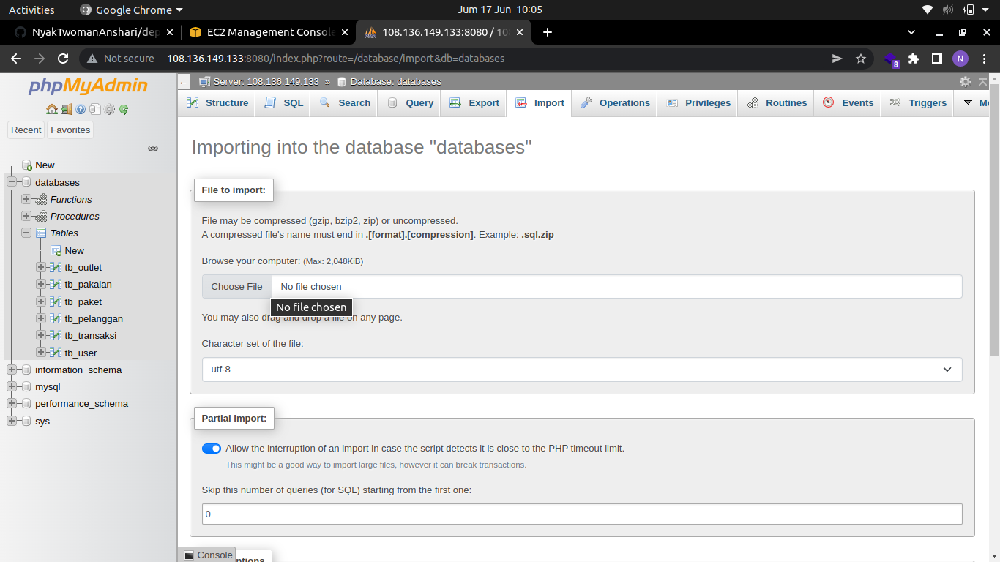 <br>

- Pilih database php yang telah di buat ```laundry2.sql``` pada local komputer <br> 
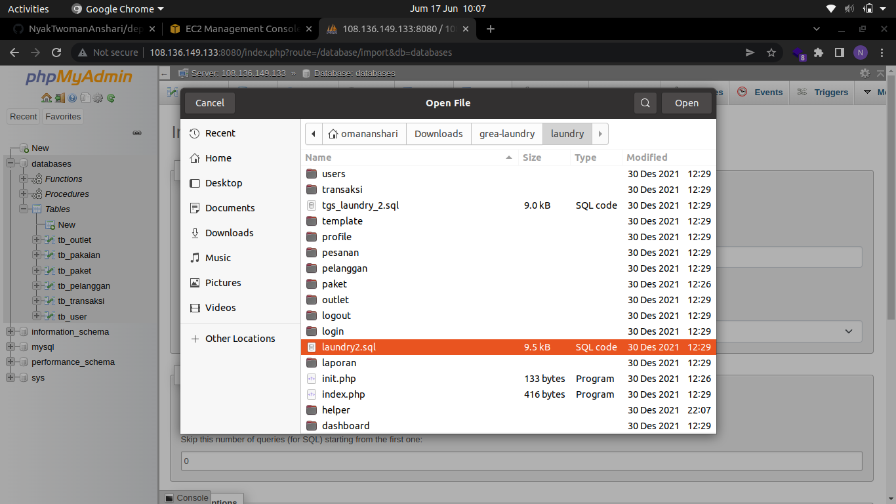 <br>

## Deployment Web App PHP
- Keluar dari directory phpmyadmin ```cd ..```
- Selanjutnya buat directory baru ```mkdir deploy-php``` untuk mendeploy app php
- Masuk ke directory core ```cd core``` lalu ubah konfigurasi di ```config.php``` sesuai dengan database yang telah dibuat <br>
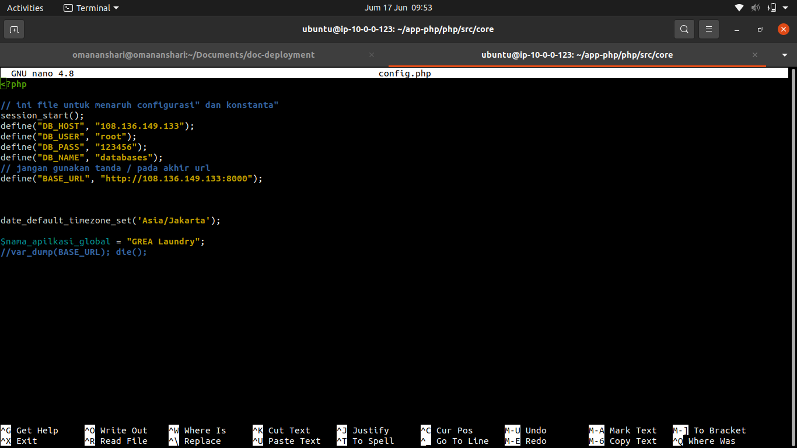 <br>

- Kemudian pindah kembali ke directory ```deploy-php``` buat ```Dockerfile``` dengan konfigurasi sebagi beikut. Dockerfile tersebut digunakan untuk membuat image <br>
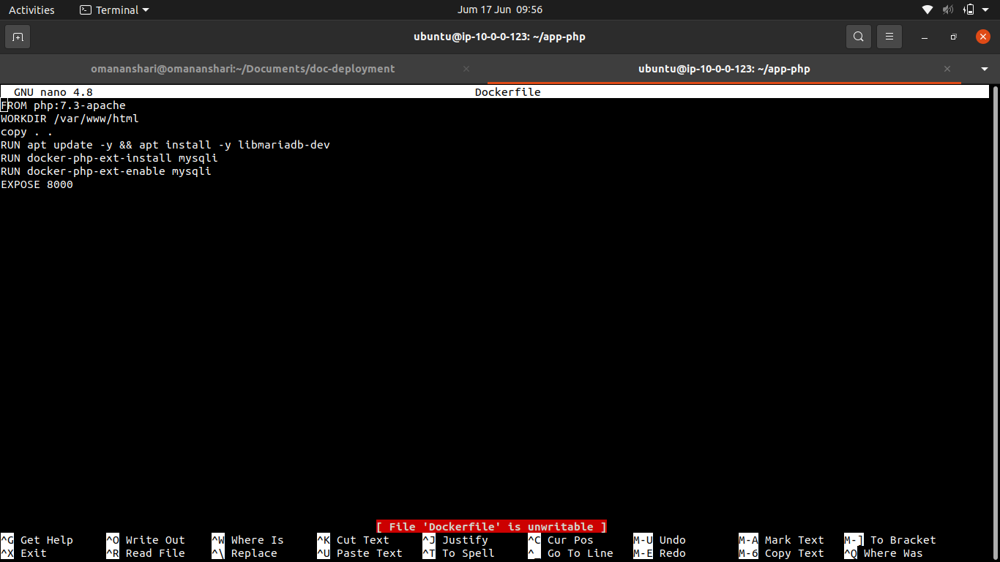 <br>

- Jalankan perintah ```docker buid -t app-php .```  untuk membuat image dengan nama app.php
- Buat ```docker-compose.yml``` dengan konfigurasi sebagai berikut <br>
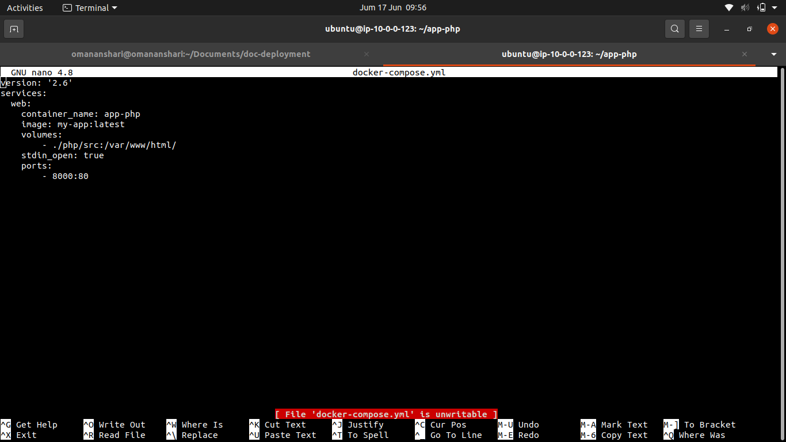 <br>

- Jalankan perintah ```docker-compose up -d``` untuk membuat container sesuai konfigurasi pada docker compose
- Buka browser kemudian ketik IP server dan port docker dari container yang telah di deploy <br>
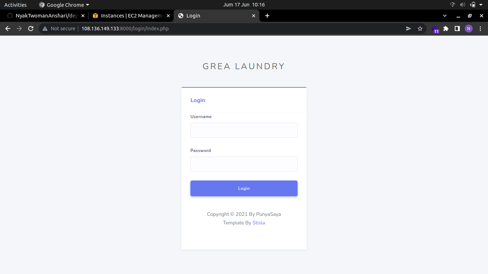 <br>
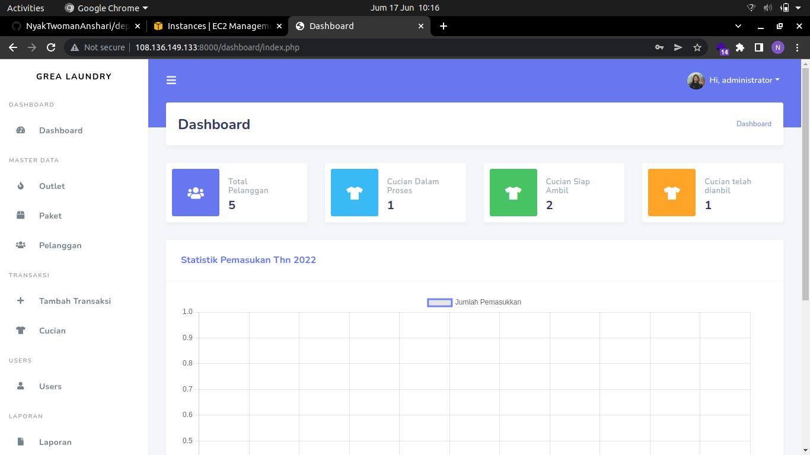 <br>

## AWS Server Setting Firewall
- Buka AWS console
- Pilih menu ```EC2``` lalu menu ```Instances``` dan pilih nama server yang telah kita buat
- Pilih menu ```security``` lalu pilih security groups <br>
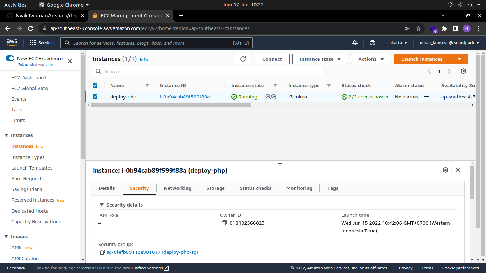 <br>

- Pada menu security group pilih menu ```Edit inbound rules``` <br>
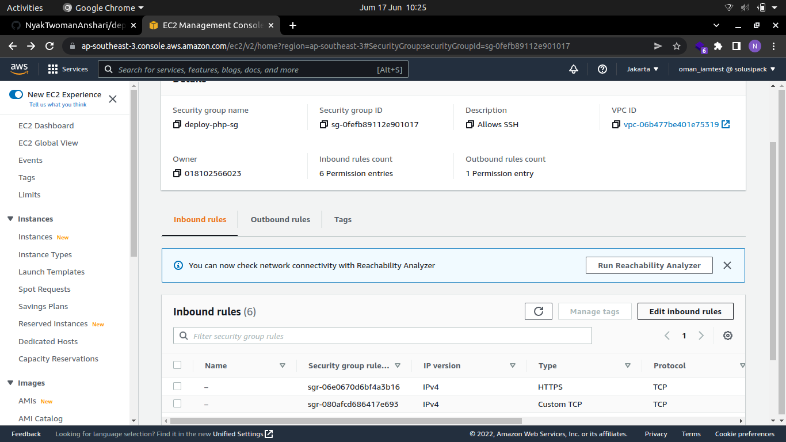 <br>

- Pilih menu ```Add rule``` lalu ```Custom TCP``` isi ```Port range``` dengan port docker yang telah di deploy dan isi ```CIDR block``` sesuai dengan block IP yang telah dibuat <br>
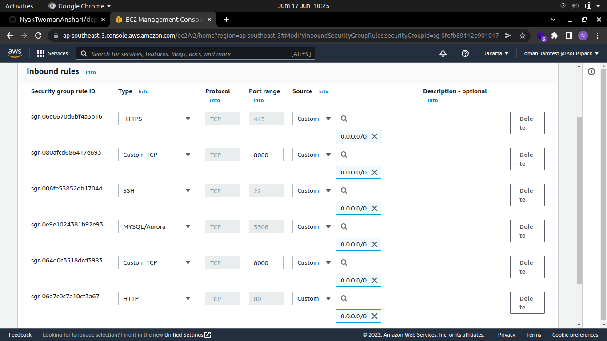 <br>